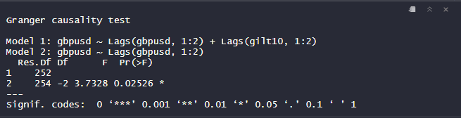
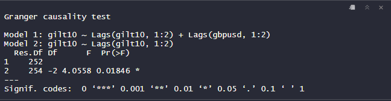

```{r setup, include=FALSE}
knitr::opts_chunk$set(echo = FALSE)
```


This project was motivated based on the recent market reaction to the Mini-Budget announcement by Kwasi Kwarteng, the Chancellor of the UK Exchequer. This market reaction saw both the gilts markets and the GBP-USD fx market having a sharp volatility with the latter witnessing a record low of the British pound against the dollar.

While I also believe the tax cuts to have been an ill-timed project, I was more interested in how sharp these markets reacted to that announcement, and went ahead to conduct a granger causality test testing the relationship between these two markets that stood out.

The image below shows the first model explaining the gilt 10 year bonds on the Gbp-Usd exchange price, indicating that at the 5% level of significance, we reject the null hypothesis of no relationship.

{width=1000} 
The image below also shows the second model explaining the gbp-usd exchange prices on the gilt 10year bonds, indicating also that at the 5% level of significance, we reject the null hypothesis of no relationship.

{width=1000} 

Overall, I conclude on a bidirectional causality relationship between the two markets which present a potential forecasting feature. The full codes and discussion are attached in my GitHub File which is accessible above.