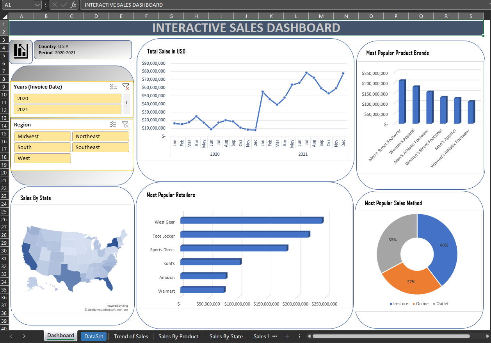

```{r setup, include=FALSE}
knitr::opts_chunk$set(echo = FALSE)
```

As part of displaying some of my best works as a data analyst, this excel dashboard stands out because of its interactive and real-time updates. It is important to state that I have taken the liberty of downloading a different dataset and recreated this dashboard I made for a previous client. In addition to this project, I worked on an Investment Portfolio Tracker & Dashboard for this same client.

In creating this dashboard, I employed the use of pivot tables and charts, with the slicer feature to filter the report by year and regions. The dashboard reports sales as a trend, in addition to the other Key Performance Indicators. This dashboard report was useful in a further What-If analysis done with the dataset. 

{width=2000}

As a result of the Non-disclosure Agreement signed with all of my clients, it is impossible to share the original file but this dashboard shared above is a fair replica of my work for this client. I have attached the complete Excel file to my Github, accessible in the homepage of this website.


