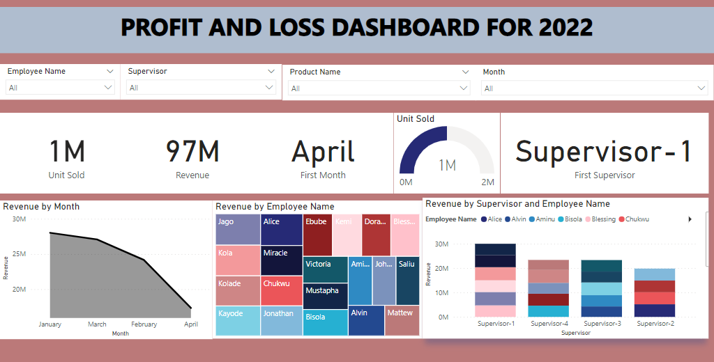

```{r setup, include=FALSE}
knitr::opts_chunk$set(echo = FALSE)
```

As part of showing some of my works on PowerBI, this dashboard I am sharing below reports a profit and loss to measure financial performance of a client's employees. To protect the confidentiality of these employees and respect my NDA agreement signed with the client, I have simulated a seperate dataset and built this dashboard based on that.

This dashboard was fully completed on PowerBI with the same contractual requirements the client asked of me. It is also important to mention that a second dashboard reports these employees performance by certain KPIs.

{width=2000}

The full PowerBI file is in my Github Page.